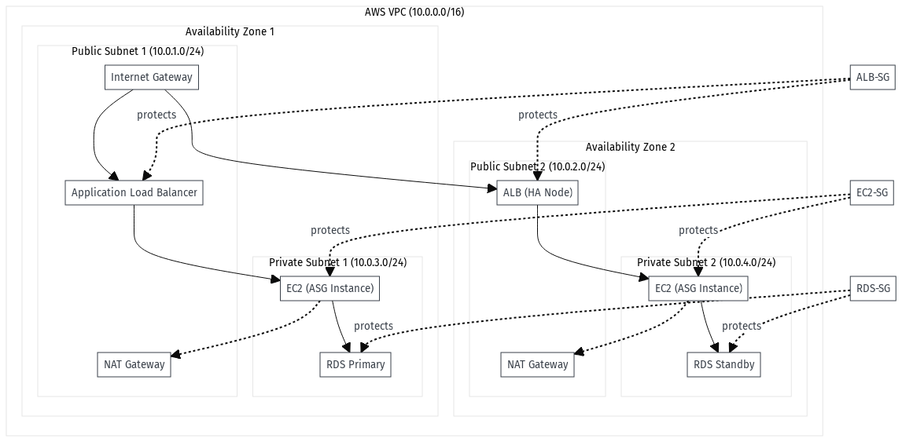

# Ahmed-AWS-Lab
# Deployment Guide: Scalable Web App on AWS

This guide provides a detailed, step-by-step process for deploying the Scalable Web Application on AWS.
## Contents:
* Diagram in .png extention
* Steps of the implementation 
## Solutin overview 
* Architecture: EC2-based
* Description:
   Deploy a simple web application on AWS using EC2 instances, ensuring high availability and scalability with Elastic Load Balancing (ALB) and Auto Scaling Groups (ASG). The project       demonstrates best practices for compute scalability, security, and cost optimization.
* Key AWS Services Used:
   * EC2: Launch instances for the web app.
   * Application Load Balancer (ALB): Distributes traffic across multiple instances.
   * Auto Scaling Group (ASG): Ensures instances scale based on demand.
   * Amazon RDS (Optional): Backend database (MySQL/PostgreSQL) with Multi-AZ.
   * IAM: Role-based access to instances.
   * CloudWatch & SNS: Monitor performance and send alerts.
* Learning Outcomes:
    * Setting up secure and scalable EC2-based web applications.
    * Implementing high availability using ALB and ASG.
    * Optimizing costs and performance using Auto Scaling policies.
## Default Architecture


## Step 1: Create the VPC and Networking
1.  **Create a VPC:**
    *   Navigate to the VPC Dashboard in the AWS Console.
    *   Choose "Create VPC".
    *   **Name:** `Web-App-VPC`
    *   **IPv4 CIDR:** `10.0.0.0/16`
2.  **Create Subnets:**
    *   Create two public subnets and two private subnets in different Availability Zones within your new VPC.
    *   **Public Subnet 1 (AZ 1):** `10.0.1.0/24`
    *   **Public Subnet 2 (AZ 2):** `10.0.2.0/24`
    *   **Private Subnet 1 (AZ 1):** `10.0.3.0/24`
    *   **Private Subnet 2 (AZ 2):** `10.0.4.0/24`
3.  **Set up Internet Connectivity:**
    *   Create an Internet Gateway and attach it to `Web-App-VPC`.
    *   Create a public route table, add a route for `0.0.0.0/0` to the Internet Gateway, and associate it with your public subnets.
    *   Create a NAT Gateway in one of your public subnets to enable instances in private subnets to access the internet.
    *   Create a private route table, add a route for `0.0.0.0/0` to the NAT Gateway, and associate it with your private subnets.

## Step 2: Set up Security Groups
1.  **ALB Security Group (`ALB-SG`):**
    *   **Inbound rules:** Allow HTTP (Port 80) traffic from `0.0.0.0/0`.
2.  **EC2 Security Group (`EC2-SG`):**
    *   **Inbound rules:** Allow HTTP (Port 80) traffic from `ALB-SG` only.
    *   Allow SSH (Port 22) traffic from your IP address for management.
3.  **RDS Security Group (`RDS-SG`):**
    *   **Inbound rules:** (Optional) Allow MySQL/PostgreSQL (Port 3306 or 5432) traffic from `EC2-SG`.

## Step 3: Create the Application and Launch Template
1.  **Prepare a web server script:** This `user data` script will be executed on the EC2 instances.
    ```bash
    #!/bin/bash
    yum update -y
    yum install httpd -y
    systemctl start httpd
    systemctl enable httpd
    echo "<h1>Hello from EC2 instance on $(hostname)</h1>" > /var/www/html/index.html
    ```
2.  **Create an IAM Role:**
    *   Create an IAM role for EC2 with a policy that allows access to S3 or other services if needed.
3.  **Create a Launch Template:**
    *   Navigate to the EC2 Dashboard -> Launch Templates -> "Create launch template".
    *   **Name:** `Web-App-Template`
    *   **AMI:** Choose an Amazon Linux AMI (e.g., Amazon Linux 2023).
    *   **Instance Type:** `t2.micro` (Free Tier eligible).
    *   **Key Pair:** Select an existing key pair.
    *   **Network Settings:** Select `EC2-SG`.
    *   **Advanced Details > User Data:** Paste the web server script from above.

## Step 4: Configure the Auto Scaling Group (ASG)
1.  **Create an ASG:**
    *   Go to the EC2 Dashboard -> Auto Scaling Groups -> "Create Auto Scaling group".
    *   **ASG Name:** `Web-App-ASG`
    *   **Launch Template:** Choose `Web-App-Template`.
    *   **Network:** Select `Web-App-VPC` and the **private subnets** you created.
2.  **Configure Scaling Policies:**
    *   Set the desired, minimum, and maximum capacities for your application (e.g., Min: 1, Desired: 2, Max: 4).
    *   Create a scaling policy to scale out based on CPU utilization (e.g., `target tracking` at 50% CPU).

## Step 5: Create the Application Load Balancer (ALB)
1.  **Create an ALB:**
    *   Go to the EC2 Dashboard -> Load Balancers -> "Create Load Balancer".
    *   Choose "Application Load Balancer".
    *   **Name:** `Web-App-ALB`
    *   **VPC:** Select `Web-App-VPC`.
    *   **Subnets:** Select the **public subnets**.
    *   **Security Group:** Choose `ALB-SG`.
2.  **Create a Target Group:**
    *   Go to the EC2 Dashboard -> Target Groups -> "Create target group".
    *   **Target type:** Instances.
    *   **Name:** `Web-App-Target-Group`
    *   **VPC:** Select `Web-App-VPC`.
    *   **Health Checks:** Configure health checks (e.g., HTTP on `/`).
3.  **Associate ALB and ASG:**
    *   Go back to the `Web-App-ALB` listener and configure it to forward traffic to `Web-App-Target-Group`.
    *   In the ASG settings, attach the `Web-App-Target-Group` to the Auto Scaling group.

## Step 6: Test and Verify
1.  **Test High Availability:**
    *   Copy the DNS name of the ALB and paste it into your web browser. You should see "Hello from EC2 instance...".
    *   Refresh the page several times. The hostname should change as the ALB cycles between instances.
2.  **Test Scalability:**
    *   Use a load testing tool or manually increase traffic to the ALB.
    *   Monitor the ASG in the console to observe new instances being launched.
    *   Wait for the load to subside and watch the ASG terminate instances.

## Step 7: Clean Up
1.  Set the ASG's desired and min capacity to `0`.
2.  Delete the ASG.
3.  Delete the ALB.
4.  Delete the target group.
5.  Delete the RDS database (if created).
6.  Delete the launch template.
7.  Delete the security groups.
8.  Delete the NAT gateway, Internet Gateway, and VPC.
